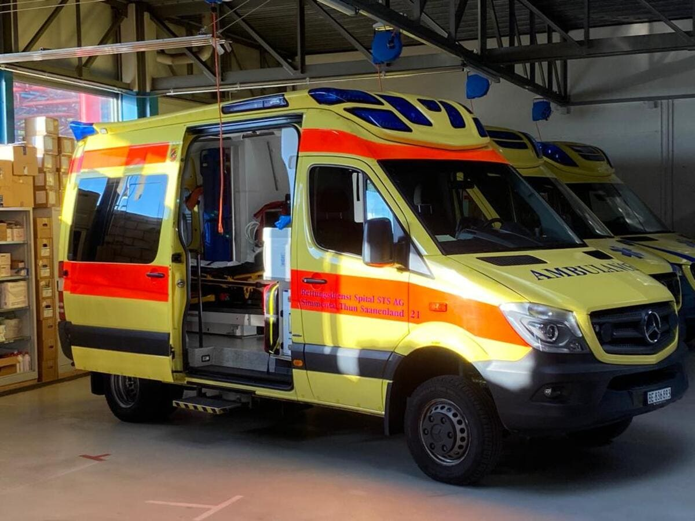

+++
title = "Wenn ein Pflaster nicht mehr hilft - Die Rettungsstation"
date = "2022-12-01"
draft = false
pinned = false
+++
{{}}

Auf einer Rettungsstation warten Rettungssanitäter*innen wie Anja Hofer gut vorbereitet auf ihren Einsatz. Sie sind für unsere heutige Gesellschaft unersetzbar. Sie nehmen täglich grosse Herausforderungen auf sich, um Menschen in Not zu helfen.   



Der Rettungsdienst ist ein wichtiger Teil unseres Gesundheits- und Sicherheitssystems. Auf dem Rettungsstützpunkt Gesigen der Spital Simmental-Thun-Saaneland (STS) AG wird täglich Leben gerettet. Die Rettungssanitäter*innen müssen viel über Medizin wissen und auch psychisch stark sein, denn im Verlauf des Berufs wird es Momente geben, bei denen der Einsatz nicht so verläuft, wie man es sich erhofft hat. Solche Situationen sind nicht einfach zu bewältigen.   

An einem Donnerstagmorgen, Punkt 7 Uhr in der Früh machen wir uns vom Bahnhof Spiez auf den Weg zum Rettungsstützpunkt Gesigen. Dort angekommen läuten wir an der Eingangstüre. Sie geht automatisch auf und wir laufen die Treppe nach oben, wo Anja Hofer uns mit einem Lächeln in Empfang nimmt. Wir folgen ihr durch den Gang in den Pausenraum, in welchem uns ihre Mitarbeiter*innen freundlich begrüssen. Danach ziehen wir uns in ein Besprechungszimmer zurück, in dem wir ihr ungestört unsere Fragen stellen. Nach dem 40-minütigen Gespräch zeigt sie uns die Rettungsstation. Sie besteht aus einer Küche, einem Aufenthaltszimmer, einem Besprechungszimmer und privaten Räumlichkeiten. Zuletzt gehen wir in die Garage, in der die Ambulanzfahrzeuge gereinigt, getankt und versorgt werden. Wir haben die Gelegenheit, in einen der Rettungswagen hineinzuschauen und uns die Ausstattung genauer anzusehen.  

## Was ist eigentlich ein Rettungsdienst? 

##  

Die ersten Formen eines Rettungsdienstes gab es unter Napoleon im 18. Jahrhundert. Da Napoleon viele Kriege führte, gab es entsprechend viele Verletzte. Um diese zu bergen und zu versorgen, gab es Soldaten, die bewusst dem Geschehen auf dem Schlachtfeld fernblieben. Diese Rettungssoldaten für Verwundete waren die ersten Rettungssanitäter. Heute ist der Rettungsdienst vor allem in den Bereichen Erste Hilfe, Notfallmedizin und Transport von Verunfallten tätig. Täglich werden in der Schweiz von den 96 Rettungsdiensten, die es hierzulande gibt, über 1200 Einsätze durchgeführt. Bei 70% dieser Einsätze handelt es sich um Notfalleinsätze. Dazu zählen Primäreinsätze von höchster Dringlichkeit (P1), bei der eine potentielle Lebensbedrohung vorliegt und Primäreinsätze mit zweitrangiger Dringlichkeit (P2), bei der die Situation des Patienten nicht lebensbedrohlich ist, aber sich noch kurzfristig ändern könnte.  Wenn man in der Schweiz den Rettungsdienst alarmieren will, kann man das sowohl über die europaweite Notfallnummer 112 wie auch über die direkte Nummer des Rettungsdienstes 144 tun. Die Aufgaben einer Rettungssanitäterin sind vielfältig. ,,Man weiss nie, was an diesem Tag passiert, wenn man am Morgen aufsteht und zur Arbeit geht,’’ meint Anja Hofer. Man kann einen Einsatz nicht wählen, und so wird man mit immer neuen Aufgaben konfrontiert und trifft auch immer auf neue Menschen und Problemstellungen. Wenn man beim Rettungsdienst arbeitet, muss man einen sehr flexiblen Zeitplan haben. Es kann immer sein, dass man kurz vor Dienstende noch einen Einsatz bekommt, den man fahren muss. „Wenn man dann einen Einsatz bekommt, der 2 Stunden geht, muss man halt noch 2 Stunden Überzeit machen“, sagt Anja Hofer. Es ist wichtig, dass das Umfeld Verständnis dafür aufbringt. Da es immer sein kann, dass man mit privaten Abmachungen in Konflikt kommt, weil ein Einsatz dazwischenkommt, braucht man auf jeden Fall Spontaneität und vor allem Flexibilität.   

Die Spital STS AG verfügt über insgesamt 17 Fahrzeuge. 7 Rettungswagen, 5 Einsatzambulanzen und 5 Pikettfahrzeuge. Ihr Einsatzgebiet erstreckt sich von Thun über Spiez ins Simmental und bis nach Gstaad.  Es gibt rund 100 Mitarbeitende, die alle im Dienst der Rettung stehen. Im Jahr 2021 wurden mehr als 8500 Einsätze gefahren, wovon 48% zur höchsten Prioritätsstufe zählten. Man arbeitet mit easyCab zusammen, ein Unternehmen, welches sich um die Patiententransporte kümmert. Und mit firstresponder.be, welche Zivilisten beschäftigen, die bereits vor den Rettungskräften vor Ort sind und die ersten Massnahmen einleiten können.   



## Ausbildung   

Anja ist seit dem 1. März dieses Jahres als diplomierte Rettungssanitäterin HF beim Rettungsdienst Thun tätig. Ursprünglich lernte sie Fachfrau Gesundheit (FaGe). Bereits dort kam sie mit der Medizin in Berührung, die sie schon immer fasziniert hatte. Nach ihrer Lehre als FaGe war sie als Fitnesstrainerin tätig. In dieser Tätigkeit fehlte ihr allerdings der medizinische Aspekt, weshalb sie sich entschloss, die Ausbildung als Rettungssanitäterin zu beginnen. Jährlich schliessen ungefähr 400 Personen die Ausbildung ab. Diese dauert normalerweise drei Jahre. Man kann sie jedoch auch in 2 Jahren absolvieren, wenn man zuvor die entsprechende Ausbildung als Pflegefachfrau/Pflegefachmann gemacht hat. In der Ausbildung lernt man viel über die Bergungstechniken, d.h. wie man Patienten in den unmöglichsten Lagen richtig versorgen und abtransportieren kann. Ebenfalls wichtige Bestandteile der Ausbildung sind die medizinischen Grundlagen. Man lernt verschiedenste Bereiche der Medizin kennen. Vor allem lernt man aber, wie man bei einem Einsatz handeln soll und wie man das erlangte Wissen am besten einsetzt. Denn richtiges Handeln entscheidet möglicherweise über Leben oder Tod. Wegen den grossen Belastungen, die die Tätigkeit als Rettungssanitäter*in mitbringt, wollen wir von Anja zudem wissen, ob es auch Leute gibt, die die Ausbildung abbrechen, weil sie merken, dass die Belastung zu gross ist. „Das gibt es immer wieder,“ sagt sie. „Doch haben wir beim Rettungsdienst den Vorteil, dass man bei uns - im Gegensatz zur Polizei - auch mal ein oder zwei Schnuppertage machen kann, in denen man ein ziemlich genaues Bild davon erhält, was einen erwartet.“ Aber je nach Einsätzen, die die Leute an den Schnuppertagen miterleben, kann es dennoch sein, dass man ein falsches Bild erhält, denn es gibt auch Tage, an denen sehr wenig oder nichts Gravierendes passiert.   

## Welche Geräte sind bei einem medizinischen Einsatz dabei?   

### “Bei einer Reanimation nehmen wir immer den Lucas mit.”  

> Anja Hofer

Wenn ein Einsatz bei der Zentrale eingegangen ist, läuft das für den Einsatz zugewiesene Team die Treppe herunter und rennt schnellstmöglich hinüber zur Garage, in der die Einsatzfahrzeuge stehen. Eben dies tun wir auch. Wir rennen die Treppe hinunter und laufen über den Parkplatz zur Garage. Dort will uns Anja Hofer einen einsatzfertigen Rettungswagen zeigen. Was auf den ersten Blick auffällt, ist, dass alles blitzsauber und sehr gut aufgeräumt ist. Ausserdem liegt nichts herum und alles ist fest angemacht, da bei einem rasanten Einsatz nichts herumfliegen darf. Das wäre ein zu grosses Verletzungsrisiko, und man hat auch keine Zeit, bei einem Einsatz noch Geräte zusammenzusuchen. Anja sagt, dass bei fast jedem Einsatz der Monitor dabei sei. Mit diesem könne man alles Mögliche machen, vom Überwachen des Patienten bis zur Defibrillation. Auch der Einsatzrucksack ist fast immer dabei. Er ist vor allem für die Erstversorgung ausgestattet. Es sind Medikamente, Infusionen und Sauerstoff vorhanden, also alles, was man für die Erstversorgung der Patienten braucht, bevor sie in den Wagen transportiert werden. Ein sehr markantes Gerät, das im Rettungswagen vorhanden ist, ist der sogenannte Lucas. Es sieht aus wie ein Bogen, aus dem so etwas wie ein Saugnapf herauskommt. Anja sagt: „Bei einer Reanimation nehmen wir ihn immer mit. Der Lucas ist eine Maschine, die für uns drückt.” Das Drücken bei der Herzdruckmassage sei sehr anstrengend, und deshalb sei der Lucas eine optimale Unterstützung. Jedoch gibt es auch noch viele andere Geräte, die bei Bedarf zum Einsatz hinzugefügt werden. Wenn man zum Beispiel mit einer bewusstlosen Person mit Erbrochenem oder Essensresten in der Speiseröhre rechnet, nimmt man zusätzlich eine Absaugeinheit mit, um die Atemwege freizulegen. So kann der Patient mit ausreichend Sauerstoff versorgt werden. 

## Was sind die psychischen Belastungen und wie geht man damit um?   

### „Beim Psychischen muss man gut „bödelet“ sein.“  

> Anja Hofer 

Bei einem Einsatz kann alles passieren. Man kann wunderschöne und herzerwärmende Momente erleben, aber auch schlimme und belastende Situationen, von üblen Verletzungen bis hin zu Todesfällen. Solche Erlebnisse sind nicht einfach zu verarbeiten; deshalb wollten wir wissen, ob man irgendeine Form von professioneller Unterstützung bekommt. „Wenn uns etwas belastet, haben wir intern eine Peergruppe, mit der wir immer sprechen können. Auch die Team- oder Betriebsleitung hat immer ein offenes Ohr für uns“, sagt Anja. Ebenfalls sei es möglich, psychologische oder sogar psychiatrische Hilfe in Anspruch zu nehmen, falls dies nötig sei. Jedoch sei es wichtig, dass man allgemein gut „bödelet“ sei. Der Job als Rettungssanitäter*in ist auch psychisch sehr anspruchsvoll, weshalb er nicht für alle geeignet ist. Jede Person hat ihre eigene Strategie, um mit dem Erlebten umzugehen und es zu verarbeiten. „Viele machen Sport, um den Kopf zu lüften“, meint Anja. Wir fragen sie auch, ob man sich manchmal Vorwürfe mache, wenn es bei einem Einsatz zu einem Todesfall oder zu einer schwer beeinträchtigenden Verletzung gekommen sei; ob man sich da nicht frage, ob man noch mehr hätte machen können, um die Person zu retten. Anja meint: „Den perfekten Einsatz gibt es nie. Das ist etwas, das man in der Ausbildung lernt und auch mit der Zeit einfach akzeptieren muss.“ Auch ist es wichtig, nach einem Einsatz mit dem Partner zu sprechen, ob er oder sie dieselben Eindrücke gehabt habe. Und was man für das nächste Mal noch verbessern könnte.   

Nach dem Besuch auf dem Rettungsstützpunkt Gesigen endet der Morgen für uns. Wir bedanken uns bei den Sanitätern und Sanitäterinnen und machen uns auf den Weg nach draussen, wo Anja auf uns wartet. Sie bietet an, uns an den Bahnhof nach Spiez zu bringen. Dieses Angebot nehmen wir an. Auf der Fahrt zum Bahnhof bedanken wir uns ein letztes Mal für den Besuch und für das Interview. Nicht jeder hat schon einmal eine Rettungsstation von innen gesehen und mitbekommen, wie dort der Tagesablauf ist. Für uns war das ein ereignisreicher, interessanter Morgen mit vielen speziellen Eindrücken, welche uns noch lange im Gedächtnis bleiben werden.   

Die Rettungssanitäter\*innen nehmen täglich sehr viel auf sich, um Menschen in Not zu helfen. Dabei ist ihnen keine Mühe zu gross und sie geben immer vollen Einsatz, was auch wichtig ist, da ihr Beruf über Leben oder Tod entscheiden kann. Ohne den Rettungsdienst gäbe es den bedeutendsten Teil unseres Rettungssystems nicht. Nicht jeder Einsatz ist ein voller Erfolg, und die Nach- und Verarbeitung nimmt viel Zeit in Anspruch. Doch gehen die Rettungssanitäter\*innen am nächsten Tag wieder motiviert und freudig - wie Anja Hofer - zum Dienst und retten im Verlaufe der Zeit vielen Menschen das Leben.